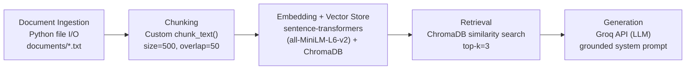

# Project 1 Planning: The Unofficial Guide

> Write this document before you write any pipeline code.
> Your spec and architecture diagram are what you'll use to direct AI tools (Claude, Copilot, etc.) to generate your implementation — the more specific they are, the more useful the generated code will be.
> Update the Retrieval Approach and Chunking Strategy sections if you change your approach during implementation.
> Update this file before starting any stretch features.

---

## Domain

The Domain I chose was Advice NJIT upperclassmen and graduates wish they had received as freshmen. I decided to go with this because as a transfer student I believed most of the resources available at NJIT weren't adequately shared. Such as a free certification in Bloomberg Market Concepts as an Engineer and being able to do financial presentation as an Engineer. 
Most students just focus on their discipline and advisors do as well. The oppurtunities that exist in specific departments aren't as widely share to the NJIT student body.

---

## Documents

<!-- List your specific sources: URLs, subreddit names, forum threads, or file descriptions.
     Aim for at least 10 sources that together cover different subtopics or perspectives within your domain. -->

| # | Source | Description | URL or location |
|---|--------|-------------|-----------------|
| 1 | Academics | REGISTRATION, PROFESSORS, AND EXAM TIPS | https://www.ratemyprofessors.com/professor/130268 |
| 2 | Campus_life | DINING, STUDY SPACES, CLUBS, AND NEWARK DINING | https://www.roomsurf.com/dorm-reviews/njit |
| 3 | Careers | NJIT CAREER AND INTERNSHIPS GUIDE | https://www.njit.edu/careerservices/cooperative-education-and-internships |
| 4 | Commuter_Resource | COMMUTE PLANNING | https://www.njit.edu/commuters/commuter-tips-and-recommendations |
| 5 | Engineering_guide | ENGINEERING DEPARTMEN OVERVIEW | ai201-project1-guide-starter/documents/Engineering_guide.txt |
| 6 | Housing | NJIT HOUSING GUIDE | ai201-project1-guide-starter/documents/Housing.txt |
| 7 | LinkedIn_networking | NJIT INTERNSHIP GUIDE | ai201-project1-guide-starter/documents/LinkedIn_networking.txt |
| 8 | Reddit_miscallaneous | INFO SCRAPED FROM REDDIT | ai201-project1-guide-starter/documents/Reddit_miscallaneous.txt |
| 9 | Skill_Building | NJIT AS A SKILL-BUILDING RESOURCE | ai201-project1-guide-starter/documents/Skill_Building.txt |
| 10 | Student_Service | NJIT STUDENT SERVICES GUIDE | ai201-project1-guide-starter/documents/Student_Service.txt |

---

## Chunking Strategy

<!-- How will you split documents into chunks?
     State your chunk size (in tokens or characters), overlap size, and explain why those
     numbers fit the structure of your documents.
     A review-heavy corpus warrants different chunking than a long FAQ. -->

**Chunk size:**
500

**Overlap:**
75

**Reasoning:**
500 to start testing and 50 because it reaches just the right amount of relevant content the other chunks has. I structured txt files to be single lines and punchy. However, this is for trial.

---

## Retrieval Approach

<!-- Which embedding model are you using (e.g., all-MiniLM-L6-v2 via sentence-tansformers)?
     How many chunks will you retrieve per query (top-k)?
     If you were deploying this for real users and cost wasn't a constraint, what tradeoffs
     would you weigh in choosing a different embedding model — context length, multilingual
     support, accuracy on domain-specific text, latency? -->

**Embedding model:**
all-MiniLM-L6-v2

**Top-k:**
5 chunks per query (started at 3, raised to 5 during Milestone 4 testing — k=3 missed the expected chunk for test question 1; will tune further once Milestone 5 generation results are in)

**Production tradeoff reflection:**
I'd swap to all-mpnet-base-v2 for more dimensions in my embeddings to capture subtle semantic distinctions that allow for disitnctions betweens chunks when they're almost identical.

---

## Evaluation Plan

<!-- List your 5 test questions with their expected correct answers.
     Questions should be specific enough that you can judge whether the system's response
     is right or wrong. "What are good dining halls?" is too vague.
     "What do students say about wait times at [dining hall name] during lunch?" is testable. -->

| # | Question | Expected answer |
|---|----------|-----------------|
| 1 | What are some courses or certifications I can take?| The Bloomberg terminal in CAPS allows you to take a self-pace certification course in Bloomberg Market Concepts |
| 2 | If I were to be looking for a career shift which department should I contact?| CDS from NJIT helps you connect with recruiters and companies that otherwise would be harder if you were to be cold applying or cold outreaching|
| 3 | How can I apply what I learn in class to actual projects? | Join clubs in order to apply theoretical concepts from classes in a real-world scenario |
| 4 | What are some alternative path to experience NJIT offers? | Highlnder Launchpad connects students to student-founded startups that help them gain real-world experience. |
| 5 | What is there to do in Newark? | NYC is is 35 mintues from newark and Ironbound is 15-20 minutes by foot which is known for the best food.|

---

## Anticipated Challenges

<!-- What could go wrong? Name at least two specific risks with reasoning.
     Consider: noisy or inconsistent documents, missing source attribution, off-topic
     retrieval, chunks that split key information across boundaries. -->

1. The model can reference something totally unrelated because the domain might be too broad?

2. The model might make something up since I do abbreviate within the .txt files.

---

## Architecture

<!-- Draw a diagram of your pipeline showing the five stages:
     Document Ingestion → Chunking → Embedding + Vector Store → Retrieval → Generation
     Label each stage with the tool or library you're using.
     You can use ASCII art, a Mermaid diagram, or embed a sketch as an image.
     You'll use this diagram as context when prompting AI tools to implement each stage. -->

---

## AI Tool Plan

<!-- For each part of the pipeline below, describe:
     - Which AI tool you plan to use (Claude, Copilot, ChatGPT, etc.)
     - What you'll give it as input (which sections of this planning.md, which requirements)
     - What you expect it to produce
     - How you'll verify the output matches your spec

     "I'll use AI to help me code" is not a plan.
     "I'll give Claude my Chunking Strategy section and ask it to implement chunk_text()
     with my specified chunk size and overlap" is a plan. -->

**Milestone 3 — Ingestion and chunking:**
I will give Claude the Documents section of planning.md and the Chunking Strategy section, and ask it to implement a pipeline script that loads my .txt files, removes structural noise and metadata lines, and splits documents into chunks matching my specified size and overlap. I will verify the output by printing 5 random chunks and checking that each one is readable on its own, free of leftover formatting artifacts, and tagged with its source filename.

**Milestone 4 — Embedding and retrieval:**
I will give Claude the chunk output from Milestone 3 and ask it to implement an embedding script using all-MiniLM-L6-v2 that stores chunks in ChromaDB with source metadata, and a retrieval function that accepts a query string and returns the top-k most relevant chunks with distance scores. I will verify by running a few test queries and confirming the returned chunks are visibly related to the question and that distance scores fall within an acceptable range.

**Milestone 5 — Generation and interface:**
I will give Claude the retrieval function from Milestone 4 and the grounding requirements from the spec, and ask it to implement a generation layer that passes retrieved chunks as context to an LLM and a simple query interface using Gradio. I will verify that responses cite their source documents and that asking a question my corpus does not cover produces a refusal rather than a generated answer.
